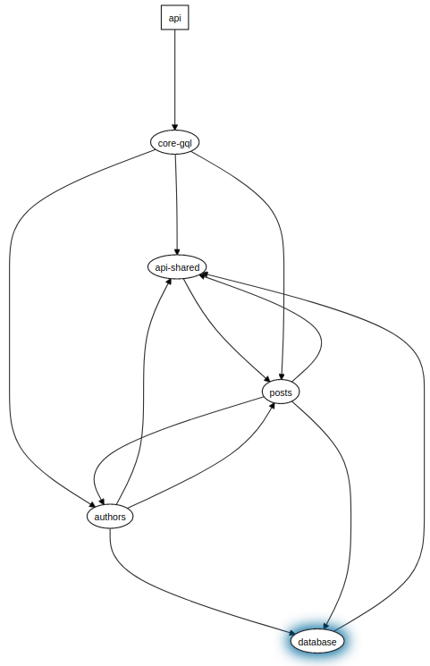

All Entites moved to `api-shared` project to avoid an unresolved Error `A circular dependency between modules`.

Now @UseGuards(JwtAuthGuard) throws an Error new InvalidDecoratorItemException(decorator, item, context.name) Error: Invalid guard passed to @UseGuards() decorator (PostsResolver)

Api visualisation:

